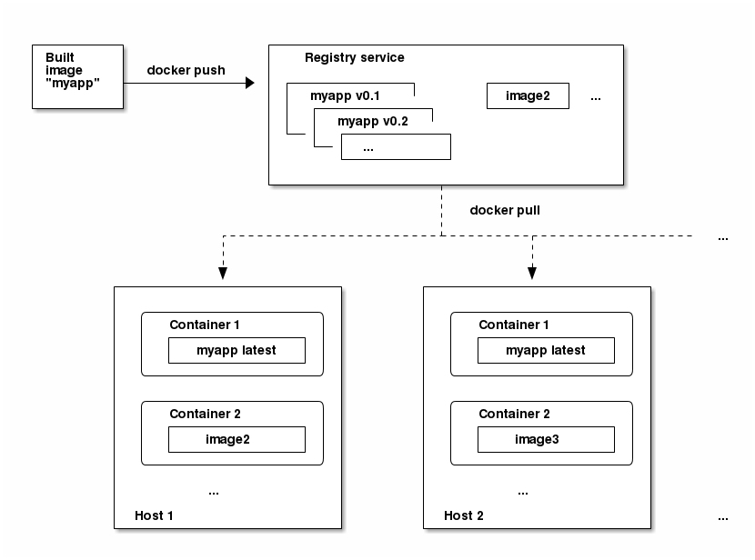

# 容器和镜像 Containers and Images

* Containers
    * Init Containers
* Images
* Container Registries

---

### 容器
OpenShift Origin应用的最基本单位称作*容器(containers)*。[Linux容器技术](https://access.redhat.com/articles/1353593)是用于隔离运行进程的轻量级机制，它们被限制只能与指定的资源交互。

很多应用进程可以运行在一个主机上的容器中，进程、文件、网络等等互相不可见。通常，每一个容器提供一个服务（经常被叫做“微服务 micro-service”），比如一个web服务器或者一个数据库，尽管容器可用于任意工作负载。

Linux内核多年来一直在集成容器技术的功能。最近Docker项目为主机上的Linux容器开发了一个方便的管理界面。OpenShift Origin 和 Kubernetes增加了跨主机编排Docker格式容器的能力。

当你使用OpenShift Origin时，尽管你不会直接与Docker CLI或者服务交互，但理解他们的功能和术语，对理解他们在OpenShift中的角色和应用程序在容器中是如何运行的，是很重要的。**docker**RPM作为RHEL 7 是可用的，包括CentOS和Fedora，所以你能在OpenShift Origin之外做实验。可浏览入门介绍文章：[Get Started with Docker Formatted Container Images on Red Hat Systems](https://access.redhat.com/articles/881893)。

#### 初始化容器 Init Containers
一个pod除应用程序容器之外，还可以有初始化容器。初始化容器让你能重新整理设置脚本和绑定代码(setup scripts and binding code)。初始化容器与常规容器不同之处在于它总是运行到完成。每个初始化容器必须在下一步开始之前成功完成。

更多信息，查看[Pods and Services](./pods-and-services.md)

### 镜像 Images
OpenShift Origin中的容器基于Docker格式的容器*镜像 images*。镜像是包含运行单个容器的所有要求的二进制文件，以及描述其需求和功能的元数据。

你可以把它理解为一种打包(packaging)技术。容器只能访问镜像中定义过的资源，除非在创建容器时给容器额外的访问权限。通过在不同主机不同容器中部署相同的镜像，并且负载均衡它们，OpenShift Origin为打包成镜像的服务提供了冗余和水平的缩放(scaling)。

你可使用Docker CLI（命令行界面）直接构建镜像，但OpenShift Origin也支持构建器镜像(builder image)，它通过添加你的代码或者配置到已有镜像中，来帮助你创建新镜像。

因为应用程序随着时间的推移而发展，所以单个镜像的名称实际上可以引用许多不同版本的“相同”图像。每个不同的镜像通过哈希（长十六进制数字，例如`fd44297e2ddb050ec4f...`，这里通常被缩短为12个字符，例如`fd44297e2ddb`）来唯一地引用。（译者注：每个镜像都有唯一的哈希，镜像名字和哈希之间是一对多的关系）。

#### 镜像版本标签策略
Docker服务除了镜像名以外，还允许使用标签(tags)（比如`v1`, `v2`, `GA`或者默认的`lastest`），以进一步指定所需的镜像，而不是用版本号，因此你可能看到相同的镜像叫做`centos`（暗示`lastest`标签）、`centos:centos7` 或者 `fd44297e2ddb`。

* 不要对官方OpenShift Origin镜像使用`lastest`标签。这些镜像开头是`openshift3/`。`lastest`可以关联为版本的数字，比如`3.4`或`3.5`。

如何标记镜像指示更新策略。你指定的越具体，镜像的更新频率就越少。使用下面的方法来确定你选择的OpenShift Origin镜像策略。

##### vX.Y
vX.Y标签指X.Y.Z-<数字>。比如，如果`registry-console`镜像更新到v3.4，它指向最新的3.4.Z-<数字>标签，比如3.4.1-8。

##### X.Y.Z
更上面vX.Y例子很想，X.Y.Z标签指向最新的X.Y.Z-<数字>。比如,3.4.1会指向3.4.1-8。

##### X.Y.Z-<数字>
标签是唯一且不可变。当使用这个标签，镜像不会更新如果一个镜像更新了。比如3.4.1-8总是指向3.4.1-8,无论镜像是否更新。

（译者注：上面三种方式好像没有区别）

### 容器注册表 Container Registries
容器注册表是一个服务，用来存储和拉取Docker格式容器的镜像。一个注册表是包含了一个或多个镜像仓库的集合。每个镜像仓库包含了一个或多个打了标签的镜像。Docker提供了自己的注册表——[Docker Hub](https://registry.hub.docker.com/)，你也可以用私有或第三方注册表。Red Hat为订阅者提供了一个注册表`registry.access.redhat.com`。OpenShift Origin也能支持内部注册表，来管理自定义容器的镜像。

容器(containers)、镜像(images)和注册表(registries)之间的关系，可以从下图中看出：

