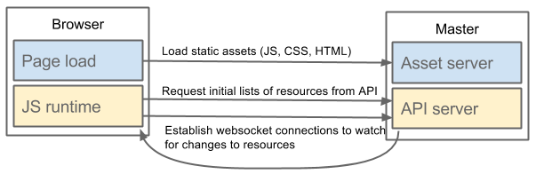
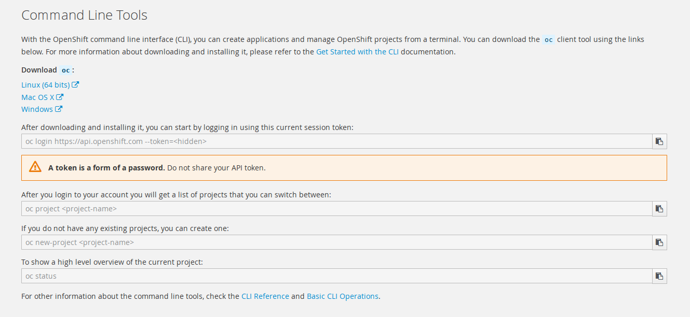
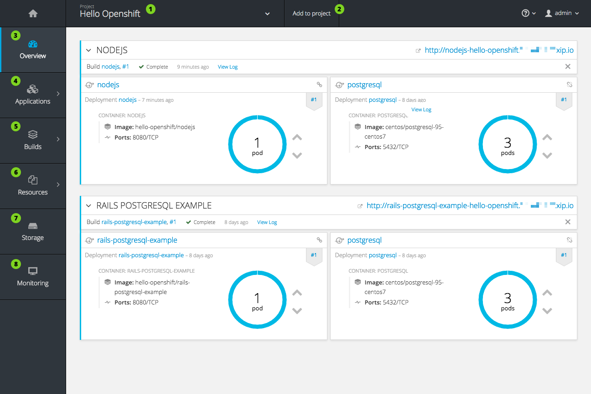
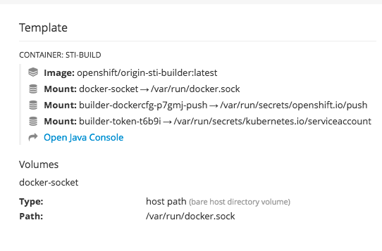
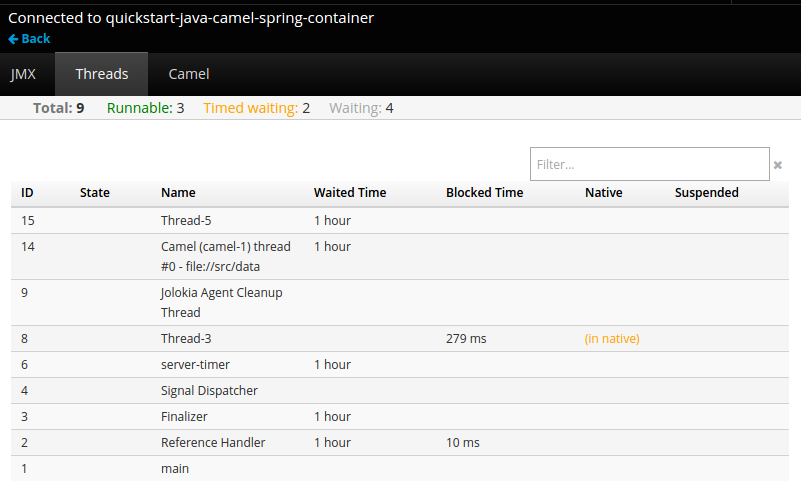

# Web控制台 Web Console
* 概述 Overview
* 命令行下载 CLI Downloads
* 浏览器条件 Brower Requirements
* 项目概述 Project Overviews
* JVM控制台 JVM Console

---
### 概述 Overview
OpenShift Origin web控制台是一个可从web浏览器访问的用户界面。开发者可以使用web控制台来可视化、浏览和管理[项目](https://docs.openshift.org/latest/architecture/core_concepts/projects_and_users.html#projects)内容。

* 必需启用JavaScript来使用web控制台。最佳实践时，使用支持[WebSockets](http://caniuse.com/#feat=websockets)的浏览器。

web控制台作为[主节点(master)](https://docs.openshift.org/latest/architecture/infrastructure_components/kubernetes_infrastructure.html#master)的一部分来启动。运行Web控制台所需的所有静态资产都由`openshift`二进制文件提供。管理员可使用扩展来自定义web控制台，可让你运行脚本和当web控制台加载时加载定制的样式。通过这种方法，你可以改变几乎所有用户界面的外观和感受。

当你通过浏览器访问web控制台时，它会首先加载所有所需的静态资源。然后请求OpenShift Origin API，使用的是`openshift start`的参数`--public-master`定义的值，或者从相关联的主节点配置文件中的参数`masterPulicURL`（译者注：是一个主机名或URL，用来访问web控制台，例如`0.0.0.0`）。Web控制台使用WebSockets来维护与API服务器的持久连接，并在可用时立即接收更新的信息。

*表1.Web控制台请求架构*

配置的主机名和Web控制台的IP地址列入白名单，以便安全访问API服务器，即使浏览器会将请求视为[跨域](http://www.w3.org/TR/cors/)。要使用不同的主机名从Web应用程序访问API服务器，必须通过在`openshift start`或相关的[主配置文件参数`corsAllowedOrigins`](https://docs.openshift.org/latest/install_config/master_node_configuration.html#master-configuration-files)上指定`--cors-allowed-origins`选项来将该主机名列入白名单。

### 命令行(CLI)下载
你可以从web控制台的`Command Line Tools`页面下载并解压CLI，在Linuex、MacOSX和Windows客户端上使用。集群管理员可以进一步[定制这些连接](https://docs.openshift.org/latest/install_config/web_console_customization.html#adding-or-changing-links-to-download-the-cli)。

### 浏览器要求
下面浏览器版本和操作系统可以用来访问web控制台。

表1. 浏览器要求
|浏览器(最新稳定版 Lastest Stable)|操作系统|
|:---|:---|
|Firefox|Fedora 23, Windows 8|
|Internet Explorer|Windows 8|
|Chrome|Fedora 23, Windows 8, and MacOSX|
|Safari|MacOSX,iPad 2, iPhone 4|

### 项目概述
[登录后](https://docs.openshift.org/latest/dev_guide/authentication.html#dev-guide-authentication)，web控制台提供给开发者当前选择的[项目](https://docs.openshift.org/latest/dev_guide/projects.html#dev-guide-projects)的概述。

*图2. Web控制器项目概述*

* ➀ 项目选择器使你能切换你访问的项目。
* ➁ 使用原始仓库或模板创建新应用
* ➂ `Overview`标签页（当前选择的）用高层级视图来可视化你的项目每个组件的内容。
* ➃ `Applications`标签页：浏览和执行部署、pods、服务和路由的操作。
* ➄ `Build`标签页：浏览和执行构建和镜像流的操作
* ➅ `Resources`标签页：查看您当前的配额消耗和其他资源。
* ➆ `Storage`标签页：查看持久的卷声明并请求应用的存储。
* ➇ `Monitoring`标签页：查看构建，pod和部署的日志，以及项目中所有对象的事件通知。

JVM 控制台
以Java镜像为基础的pod，web控制台会暴露访问一个[hawt.io](http://hawt.io/)为基础的JVM控制台，来查看和管理任何相关的集成组件。一个**Connect**链接显示出来在pod的详情在*Browse → Pods*页面，提供给容器有端口名为**jolokia**。

*Figure 3. Pod with a Link to the JVM Console*

链接到JVM控制台后，依据哪个组件是已连接pod所相关的，显示不同的页面。

*Figure 4. JVM Console*

下面是可用的页面：

|页面|描述|
|:---|:---|
|JMX|查看、管理JMX domains和mbeans|
|Threads|查看、管理线程状态|
|ActiveMQ|查看、管理Apache ActiveMQ brokers|
|Camel|查看、管理Apache Camel路由和依赖|
|OSGi|查看、管理JBoss Fuse OSGi环境|